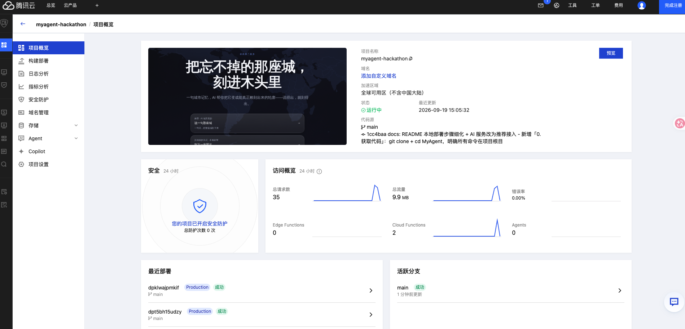

# 拾刻 Shike · 把一座城，刻进木头里

> 你说一句话、传一张照片，或从图库挑一张剪影。AI 把它变成一个能真的被激光切出来的矢量稿。
> 情绪交给 AI，几何交给算法。

---

## 它在做什么

搬家的人都有一个共同的执念：**总有一座城，走的时候没能带走。**

拾刻要做的，是把这份「带不走」变成「带得走」。你不需要会画图，不需要懂激光切割，甚至不需要知道 SVG 是什么 —— 你只需要**说一句关于那座城的话**，或者**上传一张照片**。剩下的，AI 会一路想到「能制造为止」。

首页是一张铺满全屏的世界地图：鼠标移到哪，地图就在那里亮起一圈柔和蓝光，移开就熄灭。顶部标签栏切换「创作 / 图库」——创作是两条入口，图库是内置剪影。等你把记忆交出来。

---

## 三条工作流

### 入口一 · 说一句那座城

> 输入「我想念悉尼海港边的歌剧院」，得到一张可制造的激光镂空剪影。

这条链路里，AI 不只是「画一张图」，而是**一个有思考过程的智能体**：

1. **DeepSeek ReAct Agent 先想，再动手**。它最多走 3 轮，先标准化城市、选场景，再决定下一步——每一步的决策和观察，都会在前端**逐条回放**给你看（`检索地标 → 修订简报 → 定稿`），而不是黑盒出图。
2. **Wikimedia 检索真实地标**。AI 不会凭空编造建筑，它先联网搜这座城的真实地标候选，再从中选一个。
3. **Qwen-Image 生成黑白镂空剪影**。不是随便画一张图，而是按「激光切割友好」的约束生成：白底黑主体、高对比、每个孔洞闭合、不留细碎线条。
4. **Potrace 矢量化**。把像素图变成工业级闭合矢量轮廓，按「切穿 / 划线 / 雕刻」三层输出，直接喂给激光机。
5. **降级兜底**。没配图像 API、或调用失败？自动切到参数化天际线生成器——按城市名哈希出独一无二的天际线，同样可制造，你永远拿得到一个结果。

### 入口二 · 刻下一张照片

> 上传一张照片，AI 抠出主体，变成镂空雕刻稿。

1. **Qwen-Image 主体提取**。AI 识别并隔离照片里的单一主体，清除背景、阴影、无关物件，保留可识别的外轮廓和有意义的内部孔洞。不满意最多自动修复 3 轮。
2. **Otsu 自适应二值化 + 连通域兜底**。Qwen 调用失败？退回纯本地算法，照样提取出干净的黑白主体。
3. **Potrace 镂空矢量化**。输出 `fill-rule=evenodd` 的复合路径——主体是实体，孔洞是镂空，一张图就能切穿。

### 入口三 · 从图库挑一张

> 没有本地照片、也不想打字？点开图库，挑一张内置的城市剪影，一键出图。

1. **内置城市剪影图库**。手绘了全球 11 处经典地标的闭合矢量剪影（埃菲尔铁塔、自由女神像、悉尼歌剧院、大本钟、长城、金字塔、富士山、基督像、哈利法塔、罗马斗兽场、比萨斜塔），每一张都是「外轮廓 + 内部孔洞」的 evenodd 复合路径，天然激光可雕刻。
2. **点选即出图，零失败**。点一下剪影，直接走照片那条 Potrace 镂空链路生成 SVG——不联网、不调 AI、不用等，秒出结果。
3. **同样能下载、能分享**。生成的镂空稿和照片入口完全一致，照旧支持下载 SVG 和「一键分享小红书」。

> **未来方向**：图库的下一版会放进真实的城市景色照片，走 LLM 生成链路，产出更高质量的成品图——只是目前 AI API 额度有限，暂时没接入，先用这套零成本的矢量剪影把「先拿到结果」的体验跑通。

---

## 让人眼前一亮的几个细节

- **AI 的思考是可见的**。ReAct 的每一步「检索了什么、为什么这么定、看到了什么」，都在结果下方逐条浮现，不再是黑盒。
- **双 AI 模型协同**。DeepSeek 负责「想」，Qwen-Image 负责「画」，各司其职，中间用真实的地标检索串起来。
- **AI 会失败，但你不必等**。两条链路都有多层降级，AI 挂了就切本地确定性算法，你永远拿得到一个可制造的结果。
- **Apple 流体交互**。毛玻璃材质、弹簧物理按压、生成结果逐笔描画揭示、下载成功弹跳、错误抖动入场。
- **中英双语**。顶栏「中 / EN」一键切换，全部界面即时翻译。
- **零门槛的图库入口**。不调 AI、不联网、不用打字，点一张内置剪影就出可雕刻的镂空稿——最快的「先拿到结果」路径。
- **一键分享小红书**。canvas 原生重画 SVG（不经过 Image，规避 Safari 的 canvas 污染），直接生成 PNG + 带话题文案，复制即发。
- **隐私默认脱敏**。街区、门牌号这类个人信息，默认不会写进生成的文件里。
- **接口限流防刷**。两个花钱的 AI 接口（生图、抠图）按 IP 做了限流，超频直接返回 `429`，挡住脚本盗刷额度。密钥只走服务端，永不进前端。

---

## 线上访问

项目已部署到腾讯云 **EdgeOne Pages**（Next.js 全栈应用，API 走 Cloud Functions），并绑定自定义域名提供稳定公开访问。

> **🔗 正式入口已上线（地址隐去）。如需访问，请通过仓库 Issues 或邮件留言，作者会提供访问链接。**

体验全部功能（三条工作流 + AI 思考回放 + SVG/PNG 下载），无需本地部署。下图为 EdgeOne 控制台的项目概览实况：



- **自动构建**：`git push` 到 `main` 分支后，EdgeOne 自动拉取、构建并发布最新版本，正式域名始终指向最新部署。
- **AI 能力完整**：EdgeOne 函数执行时长上限已放宽至 120 秒，足以覆盖「场景 ReAct + 生图」「照片抠图 + 矢量化」的完整链路（实测照片链路约 29 秒）。
- **HTTPS**：已启用免费证书，浏览器无安全告警。

> 本地运行（下方章节）仅作为二次开发、离线演示或自定义修改时的备用方式，评审体验优先使用线上入口。

---

## 本地运行（完整步骤）

从零开始，照着做就能跑起来。所有命令都在**项目根目录**下执行。

### 0. 获取代码

先克隆仓库，并进入项目目录：

```bash
git clone https://github.com/myandraya/MyAgent.git
cd MyAgent
```

> 之后的所有命令，都在这个 `MyAgent/` 目录（项目根目录）里执行。可以用 `pwd` 确认当前路径，应该看到它以 `/MyAgent` 结尾。

### 1. 前置要求

- **Node.js 22.18+**（项目在 `package.json` 里声明了 `engines.node >= 22.18`）。推荐用 [nvm](https://github.com/nvm-sh/nvm) 管理版本：

  ```bash
  nvm install 22
  nvm use 22
  node -v   # 应输出 v22.x.x
  ```

- **npm**（随 Node 一起安装）。无需数据库、无需任何外部服务——本项目是纯 Next.js 应用，全部数据在内存和本地文件里。

### 2. 安装依赖

```bash
npm install
```

（首次会下载几十 MB 依赖，耐心等它跑完，出现命令行提示符即为成功。）

### 3. 启动开发服务器

```bash
npm run dev
```

打开浏览器访问 `http://localhost:3000` 即可。

> **兜底说明**：即使暂时不配任何 key，项目也能跑通——两条 AI 链路会自动降级到本地确定性算法（首页地图、记忆问答、参数化天际线、图库剪影、Potrace 矢量化、SVG/PNG 下载都可用）。但**这只能算「应急兜底」**，少了「AI 思考回放」和「AI 生图/抠图」两大亮点。**要完整展示拾刻的能力，请按下一步接入真实 AI key。**

### 4.（推荐）接入真实 AI 服务

**强烈建议接入。** 拾刻的核心卖点——AI 思考回放（DeepSeek ReAct）、AI 生成地标剪影（Qwen-Image）、照片主体提取——都依赖真实 AI key。不配 key 虽然也能跑通基础流程，但会退化成纯本地确定性算法，**演示效果会大打折扣，无法体现本项目的完整能力**。要展示全部功能，请务必配置。

复制模板并填入真实 key：

```bash
cp .env.example .env.local
```

然后编辑 `.env.local`：

```dotenv
# DeepSeek —— 负责「想」：城市识别 + ReAct 选景
DEEPSEEK_API_KEY=sk-your-real-key
DEEPSEEK_MODEL=deepseek-flash

# 阿里云百炼 Qwen-Image —— 负责「画」：剪影生成 + 照片主体提取
DASHSCOPE_API_KEY=sk-your-dashscope-key
DASHSCOPE_WORKSPACE_ID=your-workspace-id   # 可选，专属端点时填
QWEN_IMAGE_MODEL=qwen-image-3.0            # 可选，默认 qwen-image-3.0
```

Key 获取：

- DeepSeek key：https://platform.deepseek.com/
- Qwen-Image key：https://bailian.console.aliyun.com/（百炼控制台）

> ⚠️ 密钥只由服务端（API Route）读取，**禁止**加 `NEXT_PUBLIC_` 前缀，否则会打包进前端泄露。`.env.local` 已在 `.gitignore` 中忽略，不会进仓库。两个 key 都缺失时，两条链路自动降级到本地确定性算法。

### 模型可以替换吗？

可以。拾刻的 AI 能力分「想」和「画」两块，可替换程度不同：

| 环节 | 当前实现 | 接口协议 | 替换难度 |
|------|---------|---------|---------|
| **「想」城市识别 + ReAct** | DeepSeek（`lib/deepseek.ts`） | **OpenAI 兼容** `/chat/completions` | **易**——改 base URL + 模型名即可 |
| **「画」剪影生成 + 照片抠图** | 阿里云百炼 Qwen-Image（`lib/image-gen.ts`） | DashScope 专有接口 | **较难**——需重写调用层 |

**DeepSeek 换起来很简单**：`lib/deepseek.ts` 调的是标准的 OpenAI 兼容 `chat/completions` 协议，任何支持该协议 + **JSON 输出模式（`response_format: json_object`）**的模型都能直接替换，例如 OpenAI GPT、Moonshot Kimi、智谱 GLM、通义 Qwen-Max、或自建的 vLLM/One-API 网关。替换时只需：

1. 改 `lib/deepseek.ts` 里的 `https://api.deepseek.com/chat/completions` 为你的模型网关地址；
2. 在 `.env.local` 里把 `DEEPSEEK_API_KEY` 换成新模型的 key、`DEEPSEEK_MODEL` 换成对应模型名。

**Qwen-Image 替换要改代码**：`lib/image-gen.ts` 用的是阿里云百炼 DashScope 的专有接口（`multimodal-generation`），不是 OpenAI 兼容协议，而且照片抠图依赖它的「图生图/图像编辑」能力。换成其他生图模型（如 DALL·E、Stable Diffusion 等）需要重写 `requestQwenImage` 这一层，不是改几个环境变量就能完成的。

### 5.（可选）生产模式运行

模拟线上环境、验证部署产物：

```bash
npm run build
npm run start
```

打开 `http://localhost:3000`。`npm run build` 会先跑 TypeScript 类型检查再产出优化构建，`npm run start` 以生产模式服务。

### 6. 质量校验（可选）

```bash
npm run typecheck   # TypeScript 类型检查
npm run lint        # ESLint
npm run test        # 单元测试（纯 Node，无需浏览器）
npm run test:e2e    # Playwright 端到端测试（需先 npm run dev）
```


---

## 三分钟演示路径

> 访问方式：线上正式入口（地址隐去，如需访问请留言获取）；或本地 `npm run dev` 后访问 `http://localhost:3000`。

1. 首页世界地图：移动鼠标，地图跟随亮起；移开熄灭。
2. 选「说一句那座城」，输入「我想念悉尼海港边的歌剧院」——看 DeepSeek 的 ReAct 思考逐条回放，Qwen 生成剪影，Potrace 矢量化，结果逐笔描画揭示。
3. 查看 DFM 制造检查结果，下载 SVG；或点「分享到小红书」生成 PNG + 文案。
4. 回首页选「刻下一张照片」，上传一张主体清晰的照片——看 Qwen 抠图，Potrace 输出镂空 SVG。
5. 顶栏切到「图库」，点一张剪影（比如埃菲尔铁塔）——不联网、不调 AI，秒出一张可雕刻的镂空稿，同样能下载和分享。

---

## 架构

```text
入口 A 一句话 ─→ DeepSeek ReAct(3轮) ─→ Wikimedia 地标检索 ─→ Qwen-Image 生成 ─→ Potrace 矢量化 ─┐
                                      ↓ (AI 失败 / 未配置)                                        ├→ DFM 检查 → SVG 下载 / 分享小红书
                                    参数化天际线兜底 ──────────────────────────────────────────────┘
入口 B 照片   ─→ Qwen-Image 主体提取(≤3轮) ─→ Otsu/连通域兜底 ─→ Potrace 镂空矢量化 ──────────────┘
入口 C 图库   ─→ 内置剪影(11 地标，evenodd 闭合 path) ─→ 复用 Potrace 镂空链路 ──────────────────────┘

（入口 A / B 的 AI 接口前均有 IP 限流：同一 IP 15 秒 1 次，超频返回 429）
```

关键模块：

- `app/api/scene`：城市识别 + ReAct 选景 + Qwen 生图 + Potrace 矢量化。
- `app/api/photo`：照片主体提取 + Otsu 二值化 + Potrace 镂空。
- `lib/deepseek.ts`：DeepSeek JSON 调用、严格字段校验、离线兜底。
- `lib/image-gen.ts`：Qwen-Image（DashScope）剪影生成 + 照片主体提取。
- `lib/potrace-vectorize.ts`、`lib/silhouette.ts`、`lib/silhouette-generators.ts`：矢量化、剪影设计、参数化天际线兜底。
- `lib/photo-vectorize.ts`：Otsu 自适应二值化 + 连通域清理（照片兜底）。
- `lib/i18n.ts`：中英双语词典 + I18nContext + useI18n。
- `lib/rate-limit.ts`：进程内 IP 限流（`allow` + `clientIp`），挡住脚本刷量，护住 AI 额度。
- `lib/share.ts`：SVG → PNG 的 canvas 原生重画（Path2D，规避 Safari taint）+ 文案复制。
- `data/gallery.ts`：内置 11 处城市地标的手绘闭合剪影（0..100 坐标系，外轮廓 + 孔洞 evenodd）。
- `components/GalleryEntry.tsx`：图库页，点选剪影 → 包装成镂空设计 → Potrace 链路出 SVG + 下载/分享。
- `data/world.geo.json`：Natural Earth 110m 国家边界（首页背景地图）。

---

## 制造文件规范

- SVG `width/height` 带 `mm`，`viewBox` 同数值。
- 红 `#ff0000` 切穿，蓝 `#0000ff` 划线，黑 `#000000` 雕刻；使用分层 `<g>`。
- 城市剪影把 Potrace 复合轮廓输出为 `engraving-fill`（黑色填充、`fill-rule="evenodd"`）。
- 照片 SVG 以 `engraving-fill` 黑色 `evenodd` 填充表达主体和孔洞，四周保留 6mm 安全边距。
- 下载文件不嵌入原图，不含 `<text>` 制造标记。

---

## 已知限制

- 「分享到小红书」生成 PNG + 文案素材供手动发布；小红书没有开放发布 API，无法自动发布到账号。
- 照片主体提取用 Qwen-Image 图像编辑能力，本地兜底是 Otsu/连通域，不含 rembg/SAM 人物抠图。
- 图库的剪影是手绘矢量轮廓，追求「可雕刻」而非照片级还原；想要更贴合实际建筑/人物的轮廓，走照片入口更合适。后续会放入真实景色照片并接 LLM 生成更高质量的图，目前受 AI API 额度限制暂未接入。
- 未配置任何 AI key 时，两条链路都能用纯本地算法跑通，但成图精度和「AI 思考过程」会降级为确定性兜底。

---

> 把忘不掉的那座城，刻进木头里。
